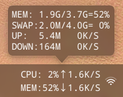
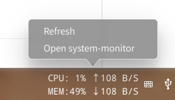

# dde-sys-monitor-plugin
## deepin系统监控dock插件，可监控CPU使用率、内存使用率、swap使用率、上传下载总量和实时网速
## dde-dock system monitor plugin
### 参考了https://github.com/sonichy/CMDU_DDE_DOCK
### 感谢大神@sonichy

单击和鼠标悬浮显示

右键显示

编译加安装：
`./build.sh`

编译好的so [下载](https://github.com/q77190858/dde-sys-monitor-plugin/raw/master/build/libsys_monitor.so)
deepin15.10.1测试可用
