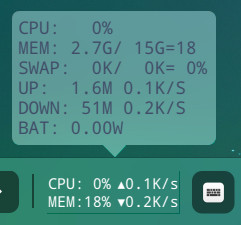
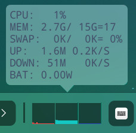
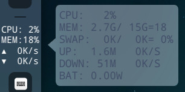
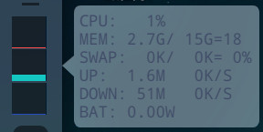
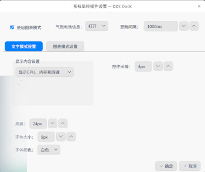
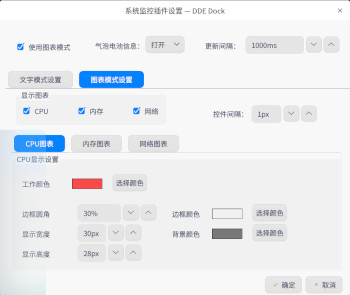

# dde-sys-monitor-plugin

deepin系统监控dock插件，可监控CPU使用率、内存使用率、swap使用率、上传下载总量、实时网速和电池放电功率，有文字模式和图表模式可选

-----------------------

## 一、参考项目

- [CMDU_DDE_DOCK for deepin](https://github.com/sonichy/CMDU_DDE_DOCK)@sonichy

- [indicator-multiload in ubuntu](https://launchpad.net/ubuntu/+source/indicator-multiload/)

## 二、图片展示

     

上四图分别是插件在文字模式和图表模式下的表现，并且插件的可配置性很高

 

右键菜单中有设置选项，可以设置各个模式下的显示内容

## 三、下载安装方式

### 1. 码云一键下载安装

deepin20.7 测试可用

```bash
wget https://gitee.com/q77190858/dde-sys-monitor-plugin/raw/master/bin/libsys_monitor.so && \
 sudo mv libsys_monitor.so /usr/lib/dde-dock/plugins/ && \
 pkill dde-dock
```

### 2. 手动下载地址

github：[libsys_monitor.so](https://github.com/q77190858/dde-sys-monitor-plugin/raw/master/bin/libsys_monitor.so)

码云：[libsys_monitor.so](https://gitee.com/q77190858/dde-sys-monitor-plugin/raw/master/bin/libsys_monitor.so)

### 3. 安装命令

```bash
sudo cp libsys_monitor.so /usr/lib/dde-dock/plugins/
pkill dde-dock
dde-dock
```

## 四、源代码编译安装

### 1. 官方插件开发教程

教程见[官方开发文档](https://github.com/linuxdeepin/dde-dock/blob/master/plugins/plugin-guide/plugins-developer-guide.md
)

### 2. 安装依赖

编译另外还需要安装如下依赖（官方的开发文档讲的环境配置不全）：

```bash
sudo apt install build-essential
sudo apt install qt5-default
sudo apt install dde-dock-dev
sudo apt install libdtkwidget-dev
#使用qtcreator集成环境可以直接设计ui界面，非必要
sudo apt install qtcreator
#deepin/uos用户使用此命令可以获取最新的qtcreator
sudo apt install io.qt.qtcreator
#使用qtcreator打开cmake工程要先安装cmake
sudo apt install cmake
```

### 3. 一键编译安装

```bash
cd dde-sys-monitor-plugin
./build.sh
```

## 五、更新日志

有问题欢迎回帖反馈！开发的心得体会参见我的博客
[http://blog.mxslly.com/archives/95.html](http://blog.mxslly.com/archives/95.html)

- 20190617 22:37更新：修复上传下载一致的bug，下载地址同上
- 20190619 12:07更新：缩减宽度，小气泡文字对齐，编译脚本优化，下载地址同上
- 20190627 16:04更新：修复时尚模式显示不全问题，现在时尚模式只显示网速
- 20190830 03:14更新：缩减1个字符宽度，现在最低单位为KB，不显示B
- 20191211 10:09更新：导入项目到qtcreator，添加设置功能，可设置显示内容
- 20200214 21:09更新：针对高分屏dpi优化；可设置显示行距；使用系统函数保存设置，更新后单击小气泡无法弹出，原因不明
- 20200322 16:31更新：添加电池功率显示
- 20200420 00:01更新：尝试修复插件界面显示为空白的UI问题，失败
- 20200421 17:01更新：修复电池信息读取失败的问题，加入电池信息开关
- 20200721 20:38更新：重构代码架构，提高可扩展性；参考indicator-multiload加入图表模式；加入很多设置选项；使用upower获取电池功率提高兼容性；适配deepin20dock的上下左右位置
- 20200818 15:50更新：根据 @zty199 的启发加入了跟随系统主题变化文字颜色的功能，仅限于文字模式
- 20200826 23:20更新：修复采样时间间隔不为1s时网速显示不准确的问题
- 20200916 21:06更新：修复插件显示有时会被dde-dock遮挡的问题；添加关于信息
- 20200922 23:51更新：修复dock在左右位置时插件留白过大的问题
- 20200928 20:06更新：修复文字模式未对齐的bug；加入控制遮挡时刷新的开关
- 20201025 12:50更新：暂时修改插件名为datetime防止被dock遮挡
- 20210216 22:50更新：文字模式增加自定义显示文字功能
- 20210517 21:34更新：新增CPU温度显示，需要安装lm-sensors
- 20220125 20:26更新: 支持新的插件函数PluginSizePolicy
- 20220902 22:43更新：适配作者的dde-dock [pr补丁](https://github.com/linuxdeepin/dde-dock/pull/446)合并，现在不会被遮挡了
