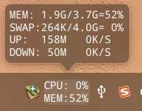
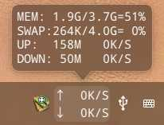
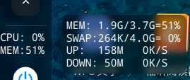
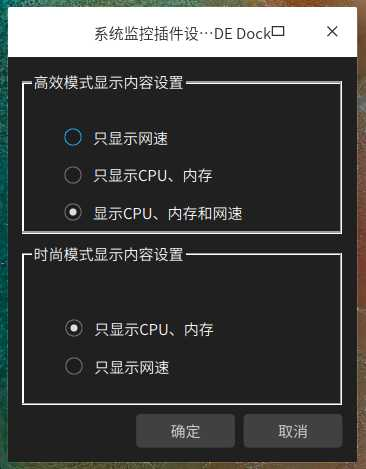

# dde-sys-monitor-plugin
## deepin系统监控dock插件，可监控CPU使用率、内存使用率、swap使用率、上传下载总量和实时网速
## dde-dock system monitor plugin
### 参考了https://github.com/sonichy/CMDU_DDE_DOCK
### 感谢大神@sonichy

    

上三图分别是高效模式下：
1. 全显示
2. 只显示CPU内存
3. 只显示网速

  

上两图分别是时尚模式下：
1. 只显示CPU内存
2. 只显示网速

  

右键菜单中有设置选项，可以设置各个模式下的显示内容

# 编译好的so [下载](https://github.com/q77190858/dde-sys-monitor-plugin/raw/master/bin/libsys_monitor.so)
deepin15.11测试可用

# 直接下载安装：
```
sudo cp libsys_monitor.so /usr/lib/dde-dock/plugins/
pkill dde-dock
dde-dock
```

# 编译加安装：
`./build.sh`

编译教程见[官方开发文档](https://github.com/linuxdeepin/dde-dock/blob/master/plugins/plugin-guide/plugins-developer-guide.md
)

编译另外还需要安装如下依赖（吐槽一下官方的开发文档讲的环境配置不全）：
```
sudo apt install dde-dock-dev 
sudo apt install qtbase5-dev-tools
sudo apt install libdtkwidget-dev
#使用qtcreator集成环境可以直接设计ui界面，目前qt版本是5.7.1
sudo apt install qtcreator
#使用qtcreator打开cmake工程要先安装cmake
sudo apt install cmake
```

有问题欢迎回帖反馈！开发的心得体会参见我的博客
[http://blog.mxslly.com/archives/95.html](http://blog.mxslly.com/archives/95.html)

20190617 22:37更新：修复上传下载一致的bug，下载地址同上

20190619 12:07更新：缩减宽度，小气泡文字对齐，编译脚本优化，下载地址同上

20190627 16:04更新：修复时尚模式显示不全问题，现在时尚模式只显示网速

20190830 03:14更新：缩减1个字符宽度，现在最低单位为KB，不显示B

20191211 10:09更新：导入项目到qtcreator，添加设置功能，可设置显示内容

20200214 21:09更新：针对高分屏dpi优化；可设置显示行距；使用系统函数保存设置，更新后单击小气泡无法弹出，原因不明
