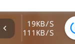

# dde-sys-monitor-plugin
## deepin系统监控dock插件，可监控CPU使用率、内存使用率、swap使用率、上传下载总量和实时网速
## dde-dock system monitor plugin
### 参考了https://github.com/sonichy/CMDU_DDE_DOCK
### 感谢大神@sonichy


单击和鼠标悬浮显示


右键显示



时尚模式截图

直接安装：
```
sudo cp libsys_monitor.so /usr/lib/dde-dock/plugins/
pkill dde-dock
dde-dock
```

编译教程见[官方开发文档](https://github.com/linuxdeepin/dde-dock/blob/master/plugins/plugin-guide/plugins-developer-guide.md
)

编译另外还需要安装如下依赖（吐槽一下官方的开发文档讲的环境配置不全）：
```
sudo apt-get install dde-dock-dev 
sudo apt-get install qtbase5-dev-tools
sudo apt-get install libdtkwidget-dev
```

编译加安装：
`./build.sh`

有问题欢迎回帖反馈！开发的心得体会参见我的博客
[http://blog.mxslly.com/archives/95.html](http://blog.mxslly.com/archives/95.html)

编译好的so [下载](https://github.com/q77190858/dde-sys-monitor-plugin/raw/master/build/libsys_monitor.so)
deepin15.10.1测试可用

###20190617 22:37更新：修复上传下载一致的bug，下载地址同上

###20190619 12:07更新：缩减宽度，小气泡文字对齐，编译脚本优化，下载地址同上

###20190627 16:04更新：修复时尚模式显示不全问题，现在时尚模式只显示网速
